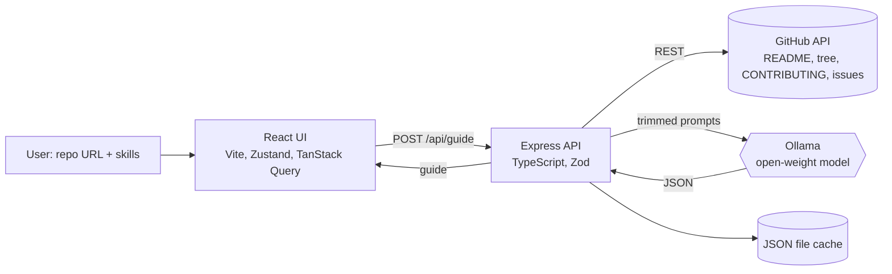

# RepoGuide

**An AI onboarding assistant for open-source repos, powered by a local open-weight model (Ollama).**
Paste a GitHub URL, optionally type your skills, and get a plain-language guide: what the project does, how it is organized, which issues to start with, and how to open your first pull request.

Built for the *Best Open-Source AI Project* challenge at Hacktoberfest Hack Day (MLH x Hustler Hive, Nashik). Licensed under the **MIT License** (see [LICENSE](LICENSE)).

## The problem
Most new contributors give up before their first PR because they:
1. can't tell what an unfamiliar repo does or how it is organized,
2. can't tell which issues are truly beginner-friendly or match their skills,
3. don't know how to start once they pick an issue,
4. find long READMEs, folder trees and CONTRIBUTING files intimidating.

## The solution
RepoGuide fetches the README, file tree, CONTRIBUTING.md and open issues from GitHub, then asks an **open-weight LLM running on your own laptop** to explain and rank them for you. No paid APIs, no accounts, no data sent to AI services.

| Feature | What the model does |
|---|---|
| Repo summary | Explains the project, its users and tech stack in plain words |
| Architecture map | Explains the main folders and key files |
| Issue finder | Ranks open issues for beginners with difficulty + "how to start" |
| Skill matcher | Picks the issues that fit *your* skills and says why |
| Checklist | Adapts fork -> branch -> test -> PR steps to the repo's CONTRIBUTING.md |

## How the open-weight model is used
- Model: **Qwen2.5 3B** by default (`qwen2.5:7b`, `llama3.2:3b` or Gemma also work), served locally by [Ollama](https://ollama.com). Change it with `OLLAMA_MODEL` in `.env`.
- The model does all the reasoning. Without it there is no guide (only a label-based issue ranking as a safety net).
- Five focused prompts (`server/src/prompts.ts`), one per feature, written for small models: short context, one task, explicit JSON shape.
- Ollama's `format: "json"` plus a repair parser (`server/src/ollama.ts`) and Zod validation (`server/src/schema.ts`). One automatic retry on bad output.
- Low temperature (0.3) for consistent output. README, tree and issue bodies are truncated to fit the context window.
- Issue titles and links come from GitHub, not the model: the model only returns issue *numbers*, so links can't be hallucinated.

## Architecture

Text version: `UI -> Express API -> GitHub API -> trim -> prompts -> Ollama (open-weight LLM) -> JSON parse/repair/validate -> UI`

## Tech stack
React 19 + Vite, Zustand, TanStack Query, Axios | Node.js + Express + TypeScript + Zod | Ollama (open-weight LLM) | GitHub REST API

## Setup (Windows, macOS, Linux)
Requirements: Node.js 20+, 8 GB RAM (16 GB for the 7B model).

```bash
# 1. Install Ollama (https://ollama.com/download), then pull a model
ollama pull qwen2.5:3b          # 8 GB RAM. On 16 GB try: ollama pull qwen2.5:7b

# 2. Install and configure
git clone <your-repo-url> repoguide && cd repoguide
npm run install:all
cp .env.example .env            # Windows: copy .env.example .env
# optional: put a free GitHub token in GITHUB_TOKEN (60 -> 5000 requests/hour)

# 3. Run (Ollama must be running: `ollama serve`)
npm run dev                     # UI http://localhost:5173, API http://localhost:8787
```

## Demo
1. Open http://localhost:5173. The green badge shows the local model is ready.
2. Click an example repo (or paste one), type e.g. `I know Python and HTML`, click **Generate guide**.
3. Read the summary, architecture map, skill matches, ranked issues and checklist.
4. Before a live demo run `npm run warm -- owner/repo` so a saved guide exists as a fallback (see [docs/DEMO.md](docs/DEMO.md)).

Screenshots: add `docs/screenshot-home.png` and `docs/screenshot-guide.png` after your first run.

## Agent Skill
The same workflow is packaged as an [Agent Skill](https://agentskills.io) in [`skills/repoguide/SKILL.md`](skills/repoguide/SKILL.md) (frontmatter `name` + `description` and step-by-step instructions). Copy the folder into any agent's skills directory; if RepoGuide is running locally the skill calls its API, otherwise it follows the steps itself.

## Project structure
```
repoguide/
├── LICENSE  README.md  .env.example
├── skills/repoguide/SKILL.md      # Agent Skill
├── server/src/
│   ├── index.ts      # Express routes, health check, error handling
│   ├── github.ts     # URL parsing + GitHub fetching, rate limits, truncation
│   ├── prompts.ts    # the 5 prompts
│   ├── ollama.ts     # Ollama call, JSON repair parser, retry
│   ├── schema.ts     # Zod validation + response types
│   ├── guide.ts      # orchestration, fallbacks, joins model output to real issues
│   ├── cache.ts      # JSON file cache (instant mode + demo fallback)
│   └── warm.ts       # pre-generate guides before a demo
├── client/src/       # React UI (App.tsx, store.ts, api.ts)
└── docs/             # DEMO.md, TEAM.md, CHECKLIST.md
```
## Troubleshooting
- **"Ollama is not running"**: run `ollama serve`. **"Model not installed"**: `ollama pull <OLLAMA_MODEL>`.
- **"GitHub rate limit reached"**: add `GITHUB_TOKEN` to `.env`.
- **Slow or invalid output**: use a smaller model (`qwen2.5:3b`) or a bigger one (`qwen2.5:7b`) for better quality.

## License
See [LICENSE](LICENSE).
"# Repoguide" 
